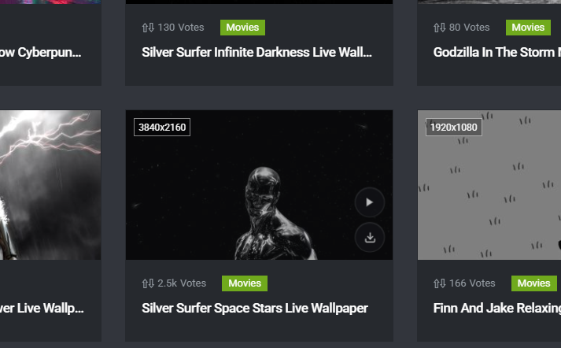
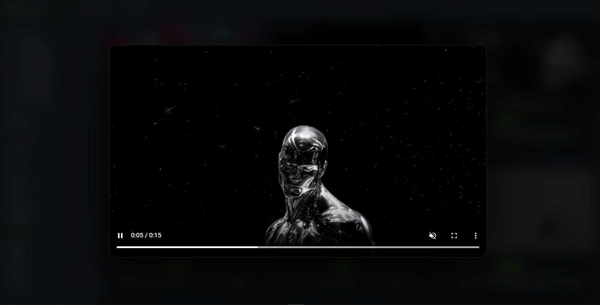

# MoeWalls Preview & Download

A focused [Tampermonkey](https://www.tampermonkey.net/) userscript that adds quick live-wallpaper preview and download actions to [MoeWalls](https://moewalls.com/).

The script is designed for people who want to inspect a wallpaper before opening its detail page and download the original video through MoeWalls’ existing download flow.

## Features

- **Quick preview on wallpaper cards.** Hover a MoeWalls wallpaper card and select the play button to open a full-screen video preview.
- **Quick download on wallpaper cards.** Select the download button to start the wallpaper download without opening the detail page first.
- **Detail-page toolbar.** Detail pages receive clearly labeled **Download** and **Preview** actions near MoeWalls’ native download control.
- **Reliable video discovery.** The script extracts `.webm` and `.mp4` sources from the fetched page HTML and prioritizes common `<source>` and `<video>` locations.
- **Short-lived local cache.** Resolved page data is cached for 20 minutes to reduce repeat requests while avoiding stale results.
- **Request deduplication and retry handling.** Simultaneous requests for the same wallpaper share one request, and missing or stale data receives one fresh retry.
- **Responsive UI feedback.** Buttons show loading, success, and error states; preview overlays close with **Escape** or by clicking the backdrop.
- **Dynamic-page support.** A mutation observer detects wallpaper cards added after navigation or filtering.

## Installation with Tampermonkey

### 1. Install Tampermonkey

Install the official browser extension from the [Tampermonkey website](https://www.tampermonkey.net/). The official site provides links for supported browsers, including Chrome, Microsoft Edge, Firefox, Opera, and Safari where available.

### 2. Install the userscript

Use the JavaScript CDN installation link below. It serves the userscript with a JavaScript content type so Tampermonkey can open its installation screen instead of displaying plain source text:

**[Install MoeWalls Preview & Download](https://cdn.jsdelivr.net/gh/0naXim0/moewalls-preview-download@main/moewalls-preview-download.user.js)**

Tampermonkey should open an installation screen. Review the requested permissions and choose **Install**.

If the link still opens as plain source instead:

1. Open the Tampermonkey extension menu.
2. Choose **Create a new script**.
3. Replace the editor contents with [`moewalls-preview-download.user.js`](./moewalls-preview-download.user.js).
4. Press **Ctrl+S** on Windows/Linux or **Cmd+S** on macOS.

### 3. Use it on MoeWalls

Open [MoeWalls](https://moewalls.com/) and browse wallpaper cards. Hover a card to reveal the circular action buttons:

- **Play:** opens the live wallpaper preview.
- **Download:** starts the original video download.

On an individual wallpaper page, use the **MoeWalls Tools** bar above the native download control. The preview overlay includes the browser’s native video controls.

## Screenshots

### Card actions

The action buttons appear when a wallpaper card is hovered.

### Live preview

The preview opens in a focused overlay with playback controls.

## Requested permissions

| Permission | Why it is used |
| --- | --- |
| `GM_xmlhttpRequest` | Fetches MoeWalls wallpaper pages and reads the video/download data needed by the two actions. |
| `GM_addStyle` | Adds the action buttons, toolbar, loading states, and preview overlay styles. |
| `GM_setValue` / `GM_getValue` | Stores short-lived per-wallpaper cache entries locally in Tampermonkey. |
| `@connect moewalls.com` | Allows requests to MoeWalls wallpaper pages. |
| `@connect go.moewalls.com` | Allows the existing MoeWalls download endpoint to be opened. |

The script is restricted to `https://moewalls.com/*` by its userscript match rule. It does not request access to unrelated websites, does not collect analytics, and does not include an external tracking service.

## Releases

Stable script packages are published in the repository’s [Releases](https://github.com/0naXim0/moewalls-preview-download/releases) tab. The source userscript remains at the repository root for inspection and automatic updates.

## Troubleshooting

**The buttons do not appear.** Confirm that Tampermonkey is enabled, the script is enabled, and the current page is on `https://moewalls.com/`. Refresh the page after installation. Buttons appear when a valid wallpaper card is hovered.

**Preview or download fails.** MoeWalls may have changed its page markup, the wallpaper may not expose a supported `.webm` or `.mp4` source, or the network request may have timed out. Refresh the page and try again. The script automatically retries once with a fresh request when cached data is incomplete.

**The script is not updating.** Open the script in Tampermonkey and confirm that automatic updates are enabled. The userscript metadata points to this repository’s `main` branch for update checks.

## Development notes

The source is intentionally distributed as a single browser userscript so it can be installed directly through Tampermonkey. No build step or package manager is required.

To modify it, edit `moewalls-preview-download.user.js`, reload the userscript in Tampermonkey, and test on a MoeWalls listing page and a wallpaper detail page. Keep requests limited to the domains declared in the metadata block.

## Responsible use

This project is an interface enhancement for MoeWalls. Use it in accordance with MoeWalls’ terms, content licenses, and applicable copyright law. Download only wallpapers you are permitted to save and use. The script does not bypass authentication or paid access.

## License

Released under the [MIT License](LICENSE).
